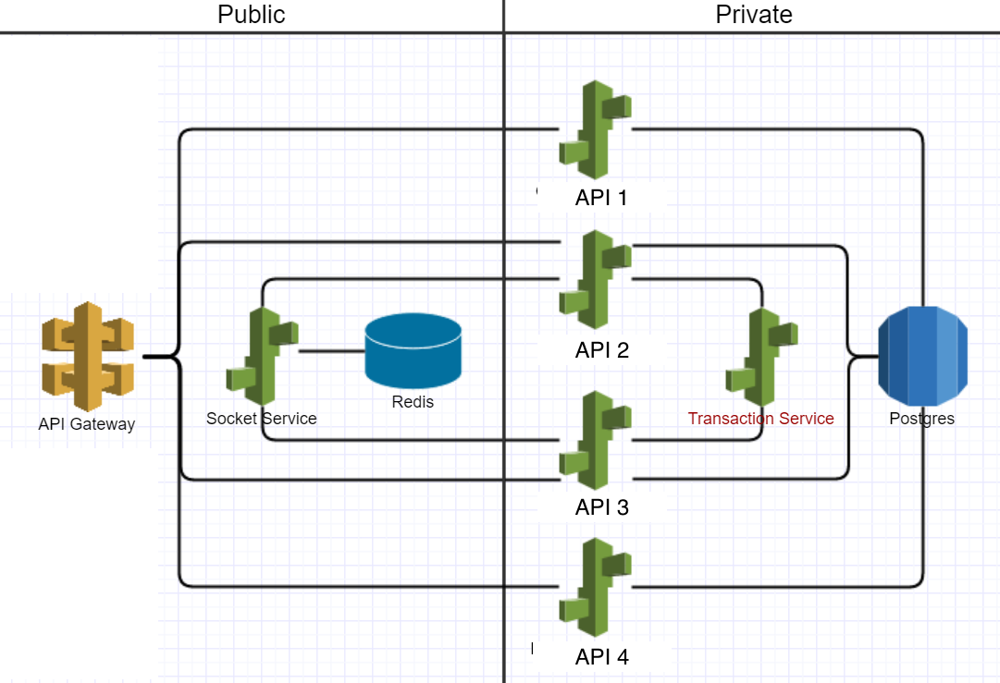

# Doshii Questionnaire

1. Given the below infrastructure image, in your opinion, what improvements could be made? What could be considered a security or performance risk?

- DB is a single point of failure. 
- The transaction service have to safe guard against race conditions by API2 and API3.
- Hopefully the API's are stateless and load balanced, multiple instances
- Internal API's are directly exposed out using the API Gatway. An API facade in the public vpc would give the private APIs more flexibility (oop encapsulation)
- All API requests seem to be served directly by the DB. Are there anything that could be cached? (more redis caches?)

2. In a hypothetical situation, AWS costs have been rising month to month by over 30%. What would you do to stem the rising costs?

- Identify which components cost most. 
- Setup billing alerts, so actions could be taken before the costs rise. 
     e.g.,  
     1. Clearing backups
- Define autoscaling groups and define rules to shutdown sevices as required. 
- Switch to reserved and spot instances where applicable
- Consider switching to linux vm's any windows vm's to avoid license costs.
- Identify application components that could be re-architected to run cheaper
- Move services to cheaper regions if possible. Usually the US regional instances cost less than other regions. It could be possible some of the batch processing tasks could be shifted like this.

3. What would you consider to be the pros and cons of outsourcing software development? What about DevOps?

- Pro's
  * Access to more skills that is not locally available
  * Possiblity to ramp up periodically during key releases
  * Potential 24 hour workforce.
  * Manual testing could be outsourced at cheaper rates

- Con's
  * Unless the team is senior, its hard to mentor and support team members
  * Monitoring overhead

- DevOps
  * Although manintenance type activities are good candidates for outsourcing, rest of infrastructure as code should be thought of as primary development. Essentially this is part of the development teams job. Each and every developer in the team will take part in DevOps activities. An infrastructure specialist (TechLead) could lead the DevOps activity planning and expert input.
